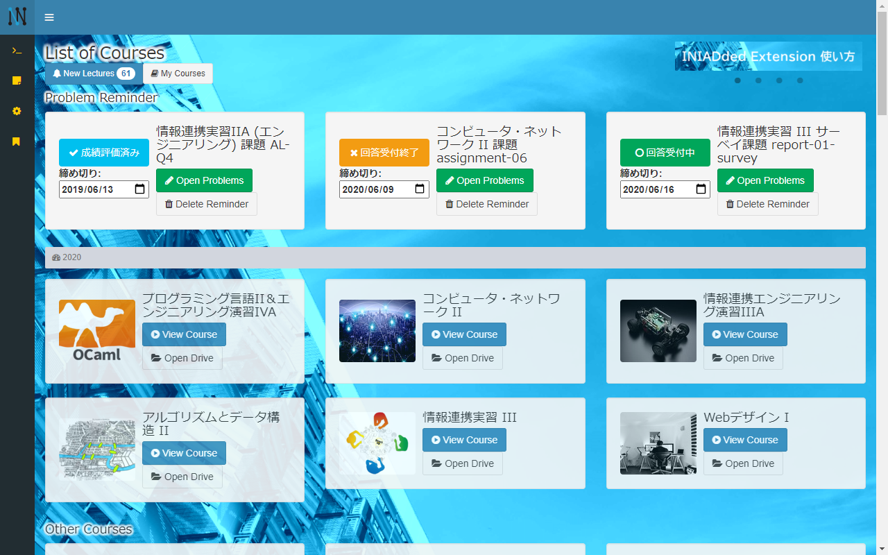

# INIADded Extension

INIADのオンライン教育システム「[INIAD MOOCs](https://moocs.iniad.org/)」に様々な便利機能を追加する Google Chrome™ の拡張機能です。

# Features
* マイコース
* 新着講義通知
* 講義時刻通知
* Python REPL
* 課題リマインダー
* ドライブボタン
* 付箋
* ヘッダー固定
* スライド縮小
* スライド複製
* スライド文字抽出
* アカウント非表示
* テーマカラー
* 壁紙
* トップに戻るボタン
* 入力文字数カウント

# Note
本ソフトウェアは、東洋大学及び東洋大学情報連携学部の公式ソフトウェア又は公式サービスとして公認、公開、頒布等しているものではありません。

本サービスにて提供する情報の正確性・妥当性につきましては細心の注意を払っておりますが、当作者はその保証をするものではありません。本サービスの利用によって利用者や第三者等にネットワーク障害等による損害、データの損失その他あらゆる不具合、不都合が生じた場合について、裁判所またはそれに準ずる機関で当作者の重過失が認められた場合を除き、当作者では一切の責任を負いません。

スライドの複製は、著作権法に違反しない範囲で行ってください。二次配布など私的利用の範囲を超えた場合は法律違反となる場合があります。スライドの複製はユーザのローカル環境で行っており、当作者サーバでの複製は行っておりません。

# Author
* Issei Terada

# Contact
お問合わせは、[こちら](https://tera-chan.com/#contact)からお願いいたします。

# License
本ソフトウェアは、[MITライセンス](./LICENSE)の下で提供されています。
